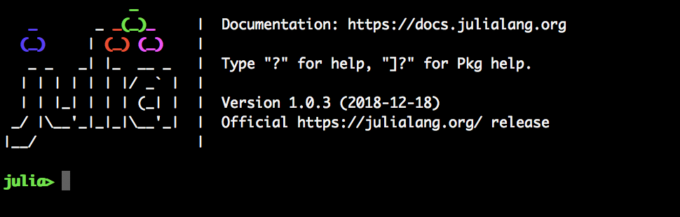
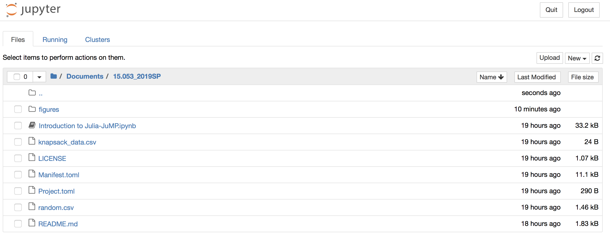

# 15.053_2019SP

### Install Julia

To get started, you first need to install Julia.

 - Download and install Julia v1.0.3 from [https://julialang.org/downloads/](https://julialang.org/downloads/).

**Windows 7 Users**: as instructed on the downloads page, you will need to
install at least version 3.0 of the [Windows Management Framework](https://docs.microsoft.com/en-us/powershell/wmf/overview).

### Download the materials

Next, you need to download a copy of these materials.

 - If you have `git`
installed, (after `cd`'ing to an appropriate directory) run
```
git clone https://github.com/juan-pablo-vielma/15.053_2019SP.git
```
 - If you don't have `git` installed (i.e., the above command fails), [download this zip file](https://github.com/juan-pablo-vielma/15.053_2019SP/archive/master.zip). Once downloaded, unzip it to an appropriate location.

### Open Julia

Now open Julia, either by typing `julia` at a terminal, or from where ever you installed it. Once open, you should be faced with the Julia *REPL* that looks like this:



### Install Jupyter

Now we need to install [Jupyter](http://jupyter.org/).
In the Julia REPL, run the following commands (this may take a little bit of time):
```julia
import Pkg
ENV["JUPYTER"]=""
Pkg.add("IJulia")
```

### Open a Jupyter notebook

Okay, last step, let's launch a Jupyter notebook! Open a Julia REPL and then run:
```julia
using IJulia
IJulia.notebook(dir="/path/to/15.053_2019SP")
```

Note: we've had some reports that `dir="~"` fails on some NIX machines. Use an
absolute path instead.

If all goes well, a browser window will open that looks like this:



To get started on the content portion of the tutorials, click on the first notebook entitled `Introduction to Julia-JuMP.ipynb`.

### Using the Default Course Packages

The files `Project.toml` and `Manifest.toml` contain the information about versions of the default course packages that we know work well. These packages can be _activated_ by running the following code in the Julia REPL of Jupyter notebook:
```julia
import Pkg
Pkg.activate("/path/to/15.053_2019SP")
Pkg.instantiate()
```

If your file is already in `/path/to/15.053_2019SP` (like the `Introduction to Julia-JuMP.ipynb` notebook), you can replace `"/path/to/15.053_2019SP"` by `@__DIR__` and instead run:
```julia
import Pkg
Pkg.activate(@__DIR__)
Pkg.instantiate()
```

### Updating Course Files and Packages

To get the latest version of this repsitory (files and safe versions of packages) you can:
- If you have `git`
installed, run the following command in `/path/to/15.053_2019SP`
```
git pull
```
 - If you don't have `git` installed (i.e., the above command fails), [re-download this zip file](https://github.com/juan-pablo-vielma/15.053_2019SP/archive/master.zip). Once downloaded, unzip it to `/path/to/15.053_2019SP`.
